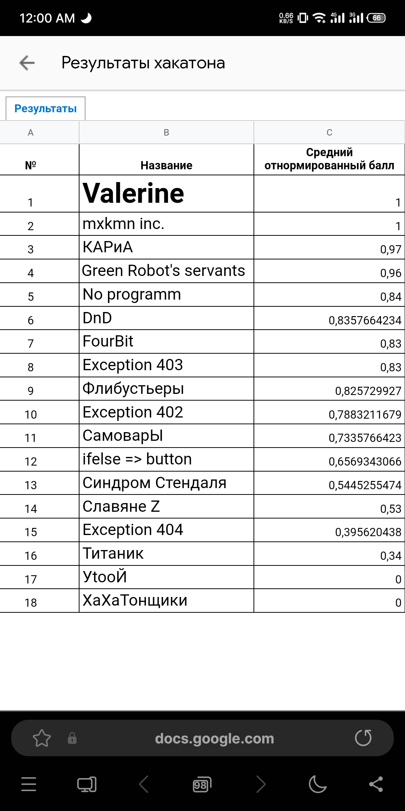

# Proof-of-concept android application for indoor navigation in large shops

The hackathon topic was the use of AR for different businesses. We came up with the concept of navigation in large shops, as it can be difficult to find what you want in them. iBeacon interaction is used to find the user's position. ARCore was used for rendering in AR, and a standalone version was also planned for unsupported smartphones with a directional arrow displaying the path. Presentation can be found [here](https://www.canva.com/design/DAFeK2p_3rk/sGm8Dvsk9VwnLywl-SJNeA/view?utm_content=DAFeK2p_3rk&utm_campaign=designshare&utm_medium=link2&utm_source=sharebutton).

It's a hackathon project by a team of four people:
* @SeeEndX: dealing with 3D models in AR Core
* @mxkmn: idea, team and repository management, working with beacons, presentation, presenter
* @Newddr: distance to user, internal coordinate system
* @AnotherBore: World Origin coordinate system, relation to user position, presenter

## Demo

https://user-images.githubusercontent.com/75564533/228146515-8d203b65-365a-426a-a9d3-52145b046df9.mp4

## Result

We scored the maximum score. Unfortunately, first place went to the team with the more technically challenging project.

The result can be verified [here](https://myitacademy.ru/sertifikaty/) (e.g. for [@mxkmn](https://github.com/mxkmn) enter `1977339677` and `Ярков`)

